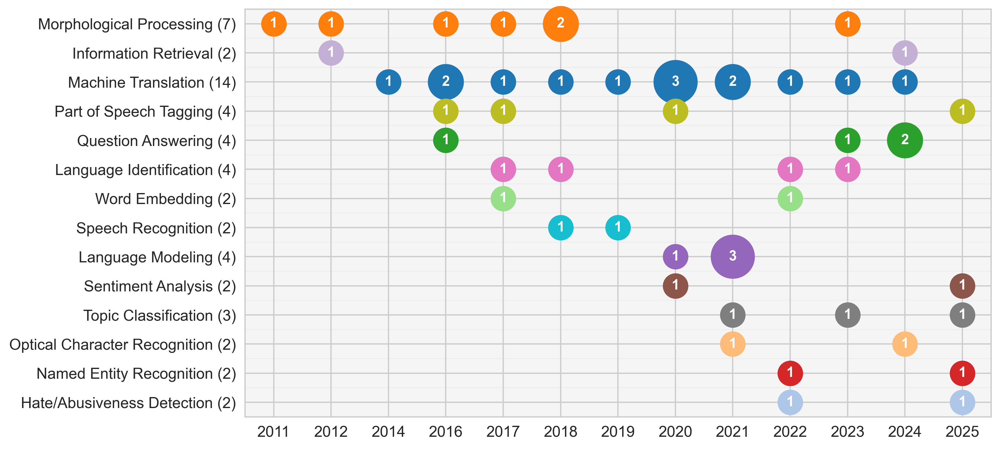

# Tigrinya NLP Anthology: Papers and Computational Resources

[](https://arxiv.org/abs/2507.17974)
[](https://github.com/fgaim/tigrinya-nlp-anthology)
[](https://creativecommons.org/licenses/by-sa/4.0/)

This repository contains the official, curated anthology of research papers and computational resources for Natural Language Processing (NLP) in Tigrinya. The collection was compiled as part of the paper: [**Natural Language Processing for Tigrinya: Current State and Future Directions**](https://arxiv.org/abs/2507.17974).

## Overview

This work presents a comprehensive survey of NLP research for Tigrinya, analyzing **45 studies** published between **2011 and 2025**. We systematically review the current state of computational resources, models, and applications across **ten distinct NLP tasks**, including:

- **Morphological Processing** - Rule-based stemmers, finite-state transducers, neural boundary detection
- **Machine Translation** - Statistical MT, Neural MT, transfer learning approaches  
- **Part-of-Speech Tagging** - CRF/SVM models, BiLSTM architectures, transformer fine-tuning
- **Named Entity Recognition** - Small-scale to large-scale annotated datasets and models
- **Text Classification** - News categorization, sentiment analysis, hate speech detection
- **Language/Dialect Identification** - Mutual intelligibility studies, dialect detection
- **Language Modeling** - Monolingual corpora construction, pre-trained transformer models
- **Question-Answering** - Factoid QA, reading comprehension benchmarks, educational datasets
- **Optical Character Recognition** - GLOCR dataset, CRNN-based models for Ge'ez script
- **Speech Recognition** - Corpus design, deep neural network applications

The research spans from early rule-based systems (2011) to modern neural architectures and large language models (2025), highlighting how community-led dataset creation has been the primary catalyst for advancement.

## Timeline and Distribution of Tigrinya NLP Research

The timeline below shows the chronological progression and distribution of publications across different task areas from our survey. The bubble size indicates the number of publications in a given year.



The survey identifie key resources and catalogs major publicly available assets that have enabled progress in Tigrinya NLP:
See the paper for comprehensive details of current assets and potential future directions.

## Using the Bibliography

The `tigrinya_nlp_anthology.bib` file contains BibTeX entries for all papers and resources covered in our survey.

### For LaTeX Users

Simply copy the BibTeX file into your project and use it like other references:

```latex
\bibliography{tigrinya_nlp_anthology}
```

### For Other Formats

Use the APA style bibliography provided in `tigrinya_nlp_anthology.apa.txt`.

### Dataset Statistics

**Total entries:** Over 40 research papers and computational resources spanning 2011-2025  
**Coverage:** Over 10 distinct NLP task areas  
**Resource types:** Datasets, pre-trained models, evaluation benchmarks, and tools

## Contributions

All contributions are very welcome in the form of adding new entries or correcting the metadata of existing ones.

- **Pull Requests:** The preferred method is to propose changes by modifying the `tigrinya_nlp_anthology.bib` BibTeX file and submitting a pull request.
- **Issues:** Alternatively, you can raise an issue to suggest new papers or resources, and we will handle the BibTeX update.

### Contribution Guidelines

When adding new entries, please include:

- Please ensure the paper or resource does not already exist before adding it.
- Complete bibliographic information (authors, title, venue, year, abstract, doi, etc)
- Primary NLP task classification using the `tasks` field. Multiple task areas can be separated by commas.

## Citing this Work

If you use the resources in this anthology for your research, you can cite the corresponding paper:

```bibtex
@misc{gaim-park-2025-tigrinya-nlp-anthology,
    title={{Natural Language Processing for Tigrinya: Current State and Future Directions}}, 
    author={Fitsum Gaim and Jong C. Park},
    month={July},
    year={2025},
    eprint={2507.17974},
    archivePrefix={arXiv},
    primaryClass={cs.CL},
    url={https://arxiv.org/abs/2507.17974}, 
}
```

## Disclaimer

This is not necessarily an exhaustive collection of all research done on Tigrinya NLP but only those that we could discover by searching major literature sources and also fit the inclusion and exclusion criteria discussed in the paper.

## Acknowledgments

Our sincere gratitude goes to all the researchers who reviewed the draft of this work and provided valuable feedback and suggestions. We invite future contributions in the form of corrections or additions of papers and resources to the open-source Tigrinya NLP Anthology project.

## License

This work is licensed under a [Creative Commons Attribution-ShareAlike 4.0 International License](https://creativecommons.org/licenses/by-sa/4.0/).

<a rel="license" href="http://creativecommons.org/licenses/by-sa/4.0/"></a>
